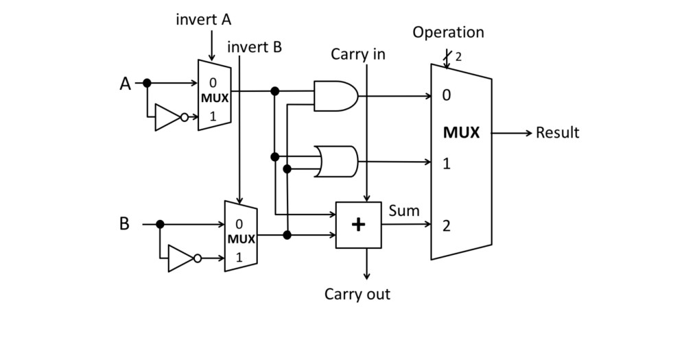
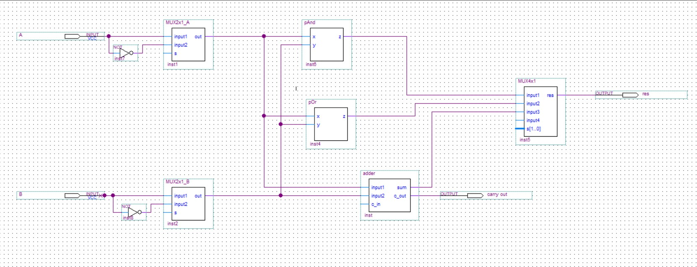

# Build Combinational Circuit

Using Verilog HDL on Quartus application i implement 1-bit ALU circuit shown in Figure below,
which i build the system components (Muxs and adder) separately,
then integrate the different system components to build the whole system.

# ALU circuit Fig

# Combinational Circuit

